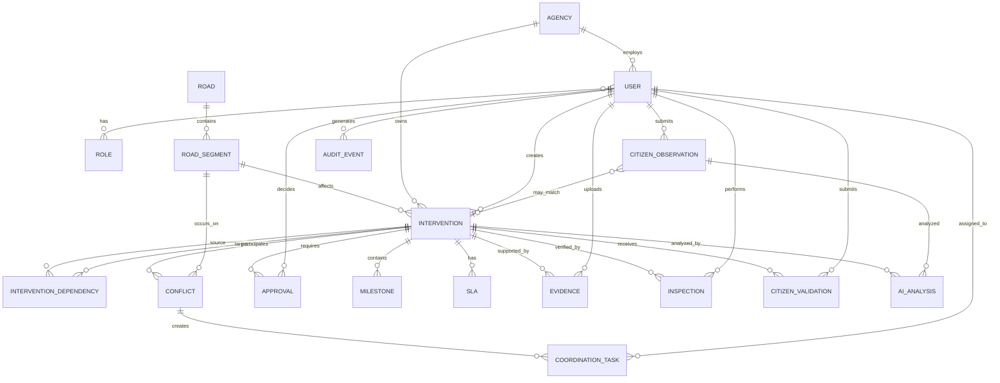

# CivicOS — Engineering Definition
## Domain Model + ERD Specification

**Version:** 1.1  
**Status:** Engineering baseline  
**SIH MVP:** Multi-agency road cutting / digging coordination  
**Architecture principle:** Coordinate existing government workflows; do not replace statutory authority.

---

# 1. Purpose

This document defines the CivicOS domain model precisely enough for:

- database design,
- backend implementation,
- API design,
- workflow implementation,
- conflict detection,
- RBAC,
- evidence management,
- AI integration,
- testing,
- Codex implementation.

It is the authoritative definition for the **domain layer**.

The model is deliberately centered on **road segments and interventions**, rather than generic complaints.

Bengaluru's existing MARCS workflow already covers road-cutting permission, verification, restoration-cost estimation, payment, permission issuance, completion inspection and release of performance security. citeturn0search0 CivicOS therefore models those existing processes as integration/workflow boundaries rather than pretending they do not exist.

IRC:98-2024 also describes the underlying coordination problem explicitly: utility services can fall under different providers/authorities; uncoordinated or ill-timed road cutting can affect traffic, pavement strength and maintenance; it recommends central geospatial service records and a coordination committee involving the road-owning authority and service providers. citeturn0search24

---

# 2. Domain Vocabulary

| Term | Meaning |
|---|---|
| Road | Logical named roadway |
| RoadSegment | Physical/geospatial section of a road used for coordination |
| Agency | Organisation responsible for an intervention or decision |
| User | Authenticated human using CivicOS |
| Intervention | Planned or actual physical work affecting infrastructure |
| Dependency | Relationship requiring one intervention to precede/follow another |
| Conflict | Detected condition where interventions or constraints interfere |
| CoordinationTask | Human task created to resolve/confirm coordination |
| Approval | Authorised decision allowing a workflow transition |
| SLA | Time-bound obligation attached to a workflow/task |
| Milestone | Significant lifecycle checkpoint |
| Evidence | Photo, document, report or other artifact supporting an event/state |
| Inspection | Authoritative field verification performed by an authorised actor |
| CitizenObservation | Ground-level observation submitted by a citizen |
| CitizenValidation | Citizen feedback on visible outcome; not statutory approval |
| AIAnalysis | Non-authoritative machine-generated analysis |
| AuditEvent | Immutable record of a significant system action |

---

# 3. ERD — High-Level



---

# 4. Entity Catalogue

The MVP contains **18 core domain entities**.

## Core operational entities

1. Agency
2. User
3. Role
4. Road
5. RoadSegment
6. Intervention
7. InterventionDependency
8. Conflict
9. CoordinationTask
10. Approval
11. SLA
12. Milestone
13. Evidence
14. Inspection
15. CitizenObservation
16. CitizenValidation
17. AIAnalysis
18. AuditEvent

Supporting infrastructure entities such as notifications, attachments, sessions and integration records can be added later without changing the core domain.

---

# 5. Agency

## Purpose

Represents an organisation participating in CivicOS.

Examples:

- road authority
- utility agency
- telecom/service provider
- traffic authority
- contractor organisation

The system must not assume that all agencies are government departments.

## Fields

| Field | Type | Required | Rule |
|---|---|---:|---|
| id | UUID | Yes | Primary key |
| code | VARCHAR(50) | Yes | Unique |
| name | VARCHAR(200) | Yes | Unique within jurisdiction |
| agency_type | ENUM | Yes | GOVERNMENT, UTILITY, TELECOM, CONTRACTOR, OTHER |
| jurisdiction | VARCHAR(200) | No | Administrative scope |
| contact_email | VARCHAR(255) | No | Valid email |
| contact_phone | VARCHAR(30) | No | Optional |
| active | BOOLEAN | Yes | Default true |
| created_at | TIMESTAMP | Yes | System generated |
| updated_at | TIMESTAMP | Yes | System generated |

## Business rules

- An inactive agency cannot create new interventions.
- Historical interventions remain associated with inactive agencies.
- Agency codes are immutable after production use.

---

# 6. User

## Purpose

Represents an authenticated human.

## Fields

| Field | Type | Required |
|---|---|---:|
| id | UUID | Yes |
| agency_id | UUID | Conditional |
| name | VARCHAR(150) | Yes |
| email | VARCHAR(255) | Yes |
| phone | VARCHAR(30) | No |
| status | ENUM | Yes |
| external_reference | VARCHAR(100) | No |
| created_at | TIMESTAMP | Yes |
| updated_at | TIMESTAMP | Yes |

Status:

```text
ACTIVE
SUSPENDED
DEACTIVATED
```

## Rules

- Government/agency users must belong to an agency.
- Citizens may have no agency.
- A deactivated user cannot create new actions.
- Historical audit records remain intact.

---

# 7. Role

## Purpose

Defines permissions.

Initial roles:

```text
CITIZEN
AGENCY_USER
ENGINEER
COORDINATOR
INSPECTOR
APPROVER
CONTRACTOR
ADMIN
```

## Fields

| Field | Type |
|---|---|
| id | UUID |
| code | VARCHAR |
| name | VARCHAR |
| description | TEXT |

A user can have multiple roles.

Relationship:

```text
USER M:N ROLE
```

---

# 8. Road

## Purpose

Logical representation of a named road.

## Fields

| Field | Type | Required |
|---|---|---:|
| id | UUID | Yes |
| official_name | VARCHAR(255) | Yes |
| alternate_name | VARCHAR(255) | No |
| jurisdiction | VARCHAR(200) | Yes |
| road_class | ENUM | No |
| geometry | GEOMETRY | Yes |
| status | ENUM | Yes |
| created_at | TIMESTAMP | Yes |
| updated_at | TIMESTAMP | Yes |

Road class may include:

```text
ARTERIAL
SUB_ARTERIAL
LOCAL
OTHER
```

## Rules

- Road geometry must be valid.
- Road is not the primary unit for conflict detection.
- RoadSegment is the primary operational geospatial unit.

---

# 9. RoadSegment

## Purpose

The primary physical/geospatial coordination unit.

A road is too broad for precise intervention matching.

## Fields

| Field | Type | Required |
|---|---|---:|
| id | UUID | Yes |
| road_id | UUID | Yes |
| segment_code | VARCHAR(100) | Yes |
| geometry | GEOMETRY(LineString) | Yes |
| start_reference | VARCHAR(255) | No |
| end_reference | VARCHAR(255) | No |
| ward | VARCHAR(100) | No |
| zone | VARCHAR(100) | No |
| surface_type | ENUM | No |
| status | ENUM | Yes |
| data_source | VARCHAR(100) | No |
| data_confidence | DECIMAL(5,2) | No |
| last_verified_at | TIMESTAMP | No |
| created_at | TIMESTAMP | Yes |
| updated_at | TIMESTAMP | Yes |

## Rules

- Geometry must be valid.
- Spatial reference system must be fixed across the application.
- Interventions must reference at least one RoadSegment for the MVP.
- A future intervention may span multiple segments through a join table if required.

---

# 10. Intervention

## Purpose

The central operational entity.

Represents planned or actual physical work.

Examples:

- water pipeline excavation
- sewer work
- electrical cable work
- telecom/OFC work
- drainage work
- road restoration
- resurfacing

## Fields

| Field | Type | Required |
|---|---|---:|
| id | UUID | Yes |
| reference_no | VARCHAR(50) | Yes |
| title | VARCHAR(255) | Yes |
| description | TEXT | Yes |
| intervention_type | ENUM | Yes |
| owning_agency_id | UUID | Yes |
| contractor_agency_id | UUID | No |
| road_segment_id | UUID | Yes |
| geometry | GEOMETRY | Yes |
| planned_start | TIMESTAMP | Yes |
| planned_end | TIMESTAMP | Yes |
| actual_start | TIMESTAMP | No |
| actual_end | TIMESTAMP | No |
| status | ENUM | Yes |
| priority | ENUM | Yes |
| risk_level | ENUM | Yes |
| source_system | VARCHAR(100) | No |
| external_reference | VARCHAR(100) | No |
| created_by | UUID | Yes |
| created_at | TIMESTAMP | Yes |
| updated_at | TIMESTAMP | Yes |

Intervention types:

```text
UTILITY_EXCAVATION
WATER
SEWER
ELECTRICAL
TELECOM
DRAINAGE
RESTORATION
RESURFACING
ROADWORK
OTHER
```

Status:

```text
DRAFT
SUBMITTED
UNDER_REVIEW
ANALYSIS
COORDINATION_REQUIRED
COORDINATION_COMPLETE
APPROVAL_PENDING
APPROVED
SCHEDULED
IN_PROGRESS
RESTORATION
EVIDENCE_PENDING
VERIFICATION_PENDING
VERIFIED
CLOSED
REJECTED
CANCELLED
ON_HOLD
OVERDUE
REOPENED
```

Priority:

```text
LOW
NORMAL
HIGH
CRITICAL
```

Risk:

```text
LOW
MEDIUM
HIGH
CRITICAL
```

## Core rules

1. `planned_end > planned_start`.
2. `actual_end >= actual_start`.
3. An intervention cannot move directly from DRAFT to CLOSED.
4. Approval is required wherever the configured workflow says approval is mandatory.
5. Only authorised actors may transition states.
6. Every state transition creates an AuditEvent.
7. An intervention cannot be marked VERIFIED without required inspection/evidence.
8. An intervention cannot be CLOSED if mandatory verification is incomplete.
9. An intervention linked to an external system must retain the external reference.
10. External integration data must not silently overwrite authoritative CivicOS decisions.

---

# 11. InterventionDependency

## Purpose

Represents an ordering or logical dependency between two interventions.

Example:

```text
BWSSB excavation
       ↓
BESCOM work
       ↓
Restoration
       ↓
Resurfacing
```

## Fields

| Field | Type | Required |
|---|---|---:|
| id | UUID | Yes |
| source_intervention_id | UUID | Yes |
| target_intervention_id | UUID | Yes |
| dependency_type | ENUM | Yes |
| reason | TEXT | Yes |
| status | ENUM | Yes |
| created_by | UUID | Yes |
| created_at | TIMESTAMP | Yes |

Types:

```text
MUST_PRECEDE
MUST_FOLLOW
CANNOT_OVERLAP
SHARED_ACCESS
RESTORATION_PREREQUISITE
```

## Rules

- Source and target cannot be the same intervention.
- Circular dependencies should be rejected.
- A dependency conflict must be raised if schedule violates a hard dependency.
- Soft dependencies may create warnings rather than blocking approval.

---

# 12. Conflict

## Purpose

Represents a detected coordination problem.

## Fields

| Field | Type | Required |
|---|---|---:|
| id | UUID | Yes |
| conflict_code | VARCHAR(50) | Yes |
| intervention_a_id | UUID | Yes |
| intervention_b_id | UUID | No |
| road_segment_id | UUID | Yes |
| conflict_type | ENUM | Yes |
| severity | ENUM | Yes |
| explanation | TEXT | Yes |
| detection_method | ENUM | Yes |
| confidence | DECIMAL(5,2) | No |
| status | ENUM | Yes |
| detected_at | TIMESTAMP | Yes |
| resolved_at | TIMESTAMP | No |
| resolved_by | UUID | No |
| resolution_note | TEXT | No |

Conflict types:

```text
SPATIAL_OVERLAP
TEMPORAL_OVERLAP
SPATIAL_TEMPORAL_OVERLAP
DEPENDENCY_VIOLATION
REPEAT_EXCAVATION_RISK
RESTORATION_SEQUENCE_RISK
RESOURCE_CONFLICT
UNKNOWN_INTERVENTION_RISK
```

Detection method:

```text
RULE
HISTORICAL_ANALYSIS
AI_ASSISTED
MANUAL
```

Status:

```text
OPEN
UNDER_REVIEW
ACCEPTED
RESOLVED
DISMISSED
```

## Rules

- A conflict must always have an explanation.
- AI-generated conflicts require human review before becoming workflow-blocking.
- Resolved conflicts remain in history.
- Duplicate conflict creation should be prevented using deterministic conflict keys.

---

# 13. CoordinationTask

## Purpose

Creates an explicit human action required to resolve or confirm coordination.

## Fields

| Field | Type |
|---|---|
| id | UUID |
| conflict_id | UUID |
| intervention_id | UUID |
| assigned_to_user_id | UUID |
| assigned_to_agency_id | UUID |
| task_type | ENUM |
| priority | ENUM |
| status | ENUM |
| due_at | TIMESTAMP |
| completed_at | TIMESTAMP |
| resolution | TEXT |
| created_at | TIMESTAMP |
| updated_at | TIMESTAMP |

Task types:

```text
REVIEW_CONFLICT
CONTACT_AGENCY
CONFIRM_SCHEDULE
REQUEST_RESEQUENCING
FIELD_INSPECTION
APPROVAL_REVIEW
EVIDENCE_REVIEW
RESTORATION_REVIEW
```

Status:

```text
OPEN
IN_PROGRESS
BLOCKED
COMPLETED
CANCELLED
OVERDUE
```

## Rules

- A task must have either a responsible user or responsible agency.
- Due dates must be calculated from SLA rules where applicable.
- Completion requires a resolution/comment where configured.
- Overdue tasks trigger escalation.

---

# 14. Approval

## Purpose

Represents an authoritative human decision.

## Fields

| Field | Type |
|---|---|
| id | UUID |
| intervention_id | UUID |
| approval_type | ENUM |
| requested_at | TIMESTAMP |
| decided_at | TIMESTAMP |
| requested_by | UUID |
| decided_by | UUID |
| decision | ENUM |
| comments | TEXT |
| required_role | VARCHAR(50) |

Approval types:

```text
ROAD_CUTTING
COORDINATION
SCHEDULE
RESTORATION
CLOSURE
```

Decision:

```text
PENDING
APPROVED
REJECTED
RETURNED
```

## Rules

- Only an authorised role may approve.
- A user should not approve their own action where separation-of-duties rules prohibit it.
- Approval must reference the state/request being approved.
- Rejected approval must contain a reason.

---

# 15. SLA

## Purpose

Represents a time-bound obligation.

Examples:

- review request within X hours
- resolve coordination issue within X days
- verify restoration within X hours

## Fields

| Field | Type |
|---|---|
| id | UUID |
| intervention_id | UUID |
| task_id | UUID |
| sla_type | ENUM |
| start_at | TIMESTAMP |
| due_at | TIMESTAMP |
| completed_at | TIMESTAMP |
| status | ENUM |
| escalation_level | INTEGER |
| breached_at | TIMESTAMP |

SLA status:

```text
ACTIVE
COMPLETED
BREACHED
PAUSED
CANCELLED
```

## Rules

- Due time is derived from configured SLA policy.
- SLA clock must not depend on a UI.
- Pause/resume behaviour must be explicitly configured.
- Breach creates an audit event and notification/escalation.

---

# 16. Milestone

## Purpose

Represents an important lifecycle checkpoint.

Examples:

```text
SITE_INSPECTION
APPROVAL_RECEIVED
WORK_STARTED
WORK_COMPLETED
RESTORATION_STARTED
RESTORATION_COMPLETED
INSPECTION_COMPLETED
VERIFICATION_COMPLETED
```

## Fields

| Field | Type |
|---|---|
| id | UUID |
| intervention_id | UUID |
| milestone_type | ENUM |
| planned_at | TIMESTAMP |
| actual_at | TIMESTAMP |
| status | ENUM |
| completed_by | UUID |
| evidence_required | BOOLEAN |
| notes | TEXT |

Status:

```text
PENDING
COMPLETED
MISSED
SKIPPED
```

---

# 17. Evidence

## Purpose

Represents proof supporting an intervention event, milestone, inspection or observation.

## Fields

| Field | Type |
|---|---|
| id | UUID |
| intervention_id | UUID |
| milestone_id | UUID |
| inspection_id | UUID |
| observation_id | UUID |
| uploaded_by | UUID |
| evidence_type | ENUM |
| storage_key | VARCHAR(500) |
| original_filename | VARCHAR(255) |
| mime_type | VARCHAR(100) |
| file_size | BIGINT |
| captured_at | TIMESTAMP |
| uploaded_at | TIMESTAMP |
| latitude | DECIMAL |
| longitude | DECIMAL |
| hash | VARCHAR(128) |
| status | ENUM |

Evidence types:

```text
BEFORE_PHOTO
DURING_WORK_PHOTO
AFTER_PHOTO
RESTORATION_PHOTO
INSPECTION_PHOTO
DOCUMENT
VIDEO
REPORT
OTHER
```

Status:

```text
UPLOADED
UNDER_REVIEW
ACCEPTED
REJECTED
SUPERSEDED
```

## Rules

- Original evidence must be retained.
- File hash should be stored for integrity checking.
- Evidence cannot be silently replaced.
- Rejected evidence remains auditable.
- Metadata should be retained when available.

---

# 18. Inspection

## Purpose

Represents an authorised field verification.

## Fields

| Field | Type |
|---|---|
| id | UUID |
| intervention_id | UUID |
| inspector_id | UUID |
| inspection_type | ENUM |
| scheduled_at | TIMESTAMP |
| performed_at | TIMESTAMP |
| result | ENUM |
| notes | TEXT |
| location | GEOMETRY(Point) |
| created_at | TIMESTAMP |

Inspection types:

```text
PRE_WORK
DURING_WORK
RESTORATION
FINAL
```

Results:

```text
PASS
FAIL
CONDITIONAL
REQUIRES_REINSPECTION
```

## Rules

- Only authorised inspectors can create authoritative inspection results.
- A failed inspection should create a follow-up task.
- Final verification requires the configured inspection type.

---

# 19. CitizenObservation

## Purpose

Represents a ground-level observation.

This is intentionally **not** an official intervention.

## Fields

| Field | Type |
|---|---|
| id | UUID |
| submitted_by | UUID |
| location | GEOMETRY(Point) |
| description | TEXT |
| category | ENUM |
| submitted_at | TIMESTAMP |
| observed_at | TIMESTAMP |
| status | ENUM |
| matched_intervention_id | UUID |
| triage_result | ENUM |
| triage_confidence | DECIMAL(5,2) |

Categories:

```text
EXCAVATION
ROAD_DAMAGE
INCOMPLETE_RESTORATION
DEBRIS
SAFETY_HAZARD
REPEAT_EXCAVATION
OTHER
```

Status:

```text
SUBMITTED
TRIAGED
MATCHED
FLAGGED
FORWARDED
RESOLVED
DISMISSED
DUPLICATE
```

Triage result:

```text
MATCHED_EXISTING_INTERVENTION
POTENTIAL_NEW_ISSUE
DUPLICATE
INSUFFICIENT_INFORMATION
INVALID
```

## Rules

A citizen observation can:

- attach to an intervention,
- trigger review,
- provide evidence,
- contribute to verification.

It cannot:

- approve work,
- modify an official schedule,
- declare statutory completion,
- close an intervention.

---

# 20. CitizenValidation

## Purpose

Represents citizen feedback on a visible outcome.

## Fields

| Field | Type |
|---|---|
| id | UUID |
| intervention_id | UUID |
| submitted_by | UUID |
| result | ENUM |
| comment | TEXT |
| submitted_at | TIMESTAMP |
| evidence_id | UUID |

Results:

```text
LOOKS_COMPLETE
LOOKS_INCOMPLETE
PROBLEM_REMAINS
CANNOT_VERIFY
```

## Rule

Citizen validation is **supporting evidence**, not statutory inspection.

---

# 21. AIAnalysis

## Purpose

Stores machine-generated analysis separately from authoritative domain decisions.

## Fields

| Field | Type |
|---|---|
| id | UUID |
| intervention_id | UUID |
| observation_id | UUID |
| evidence_id | UUID |
| analysis_type | ENUM |
| provider | VARCHAR(100) |
| model | VARCHAR(150) |
| prompt_version | VARCHAR(50) |
| input_reference | VARCHAR(500) |
| output_json | JSONB |
| confidence | DECIMAL(5,2) |
| created_at | TIMESTAMP |
| human_review_status | ENUM |
| reviewed_by | UUID |
| reviewed_at | TIMESTAMP |

Analysis types:

```text
TEXT_CLASSIFICATION
IMAGE_CLASSIFICATION
LOCATION_EXTRACTION
CONFLICT_EXPLANATION
EVIDENCE_ANALYSIS
RECOMMENDATION_EXPLANATION
```

Human review:

```text
NOT_REQUIRED
PENDING
ACCEPTED
REJECTED
OVERRIDDEN
```

## Critical rule

AIAnalysis is never itself an approval.

```text
AI result
   ↓
Business rules
   ↓
Human review where required
   ↓
Authoritative state
```

---

# 22. AuditEvent

## Purpose

Immutable record of significant actions.

## Fields

| Field | Type |
|---|---|
| id | UUID |
| actor_user_id | UUID |
| action | VARCHAR(100) |
| entity_type | VARCHAR(100) |
| entity_id | UUID |
| previous_state | JSONB |
| new_state | JSONB |
| metadata | JSONB |
| ip_reference | VARCHAR(100) |
| created_at | TIMESTAMP |

## Rules

- Audit records are append-only.
- Normal users cannot edit or delete them.
- Every workflow state transition creates an audit event.
- Approval, rejection, verification, evidence changes and administrative changes must be audited.

---

# 23. Cardinality Rules

## Agency

```text
Agency 1 ─── N User
Agency 1 ─── N Intervention
```

## Road

```text
Road 1 ─── N RoadSegment
RoadSegment 1 ─── N Intervention
```

## Intervention

```text
Intervention 1 ─── N Conflict
Intervention 1 ─── N Dependency
Intervention 1 ─── N CoordinationTask
Intervention 1 ─── N Approval
Intervention 1 ─── N SLA
Intervention 1 ─── N Milestone
Intervention 1 ─── N Evidence
Intervention 1 ─── N Inspection
Intervention 1 ─── N CitizenValidation
Intervention 1 ─── N AIAnalysis
```

## Citizen

```text
User 1 ─── N CitizenObservation
User 1 ─── N CitizenValidation
```

---

# 24. Important Relationship Constraint: Multiple Road Segments

The MVP may start with:

```text
Intervention → RoadSegment
```

But the production domain should support:

```text
Intervention N ─── M RoadSegment
```

using:

```text
intervention_road_segments
```

Reason:

A long utility project can cross several road segments.

Recommended production model:

```text
interventions
intervention_road_segments
road_segments
```

The single `road_segment_id` can be omitted once the many-to-many relation is implemented.

---

# 25. Conflict Detection Data Requirements

To detect meaningful conflicts, the database must provide:

```text
Intervention.geometry
Intervention.planned_start
Intervention.planned_end
Intervention.type
Intervention.priority
Intervention.status
RoadSegment.geometry
InterventionDependency
Historical interventions
Restoration milestones
```

Without these fields, CivicOS cannot reliably perform its core coordination function.

---

# 26. Core Business Rules

## BR-001 — Spatial overlap

Two interventions are candidates for conflict when their affected geometries intersect or fall within a configured proximity threshold.

## BR-002 — Temporal overlap

Two interventions are candidates when their planned execution intervals overlap.

## BR-003 — Spatial + temporal conflict

A high-confidence coordination conflict occurs when both spatial and temporal conditions are satisfied, subject to intervention type rules.

## BR-004 — Dependency violation

A hard dependency cannot be scheduled in an invalid order.

## BR-005 — Repeat excavation

A planned excavation after recent restoration creates a repeat-excavation risk.

## BR-006 — Approval

Approval must be performed by an authorised actor.

## BR-007 — Verification

Completion does not automatically equal verification.

## BR-008 — Closure

An intervention cannot close until mandatory milestones, evidence and verification requirements are satisfied.

## BR-009 — Citizen evidence

Citizen evidence can trigger review but cannot independently change authoritative workflow state.

## BR-010 — AI authority

AI output is advisory unless an explicitly configured human-review process accepts it.

## BR-011 — Auditability

Authoritative actions must be auditable.

## BR-012 — External system boundary

Existing government systems can be connected through adapters. CivicOS must preserve the distinction between:

```text
external record
CivicOS coordination record
CivicOS decision
```

---

# 27. Lifecycle Relationship

The complete domain lifecycle is:

```text
RoadSegment
     │
     ▼
Intervention
     │
     ├───────────────┐
     ▼               ▼
Dependencies       Conflicts
     │               │
     │               ▼
     │        CoordinationTasks
     │               │
     └───────┬───────┘
             ▼
          Approval
             │
             ▼
          Schedule
             │
             ▼
          Execution
             │
             ▼
        Restoration
             │
             ▼
          Evidence
             │
             ▼
         Inspection
             │
             ▼
        Verification
             │
       ┌─────┴─────┐
       ▼           ▼
Citizen         Authoritative
Observation     Inspection
       │           │
       └─────┬─────┘
             ▼
           Closure
```

---

# 28. Data Provenance

Every important piece of information should eventually have a source classification.

```text
OFFICIAL
AGENCY_SUBMITTED
INSPECTOR_VERIFIED
CITIZEN_SUBMITTED
AI_GENERATED
IMPORTED
SYSTEM_DERIVED
```

This is important because CivicOS will combine information from very different reliability levels.

Example:

```text
Planned date
Source: AGENCY_SUBMITTED

Actual completion
Source: INSPECTOR_VERIFIED

Citizen complaint
Source: CITIZEN_SUBMITTED

Conflict
Source: SYSTEM_DERIVED

Conflict explanation
Source: AI_GENERATED
```

The system must not treat these as equivalent.

---

# 29. Data Confidence

Where appropriate, records can carry:

```text
confidence
source
last_verified_at
```

This is especially important for geospatial infrastructure data.

IRC guidance recommends updating geospatial coordinates of utility services with a central authority. citeturn0search24

Therefore the domain should be capable of representing:

```text
utility location
source
date verified
confidence
```

without pretending that every map point is perfectly authoritative.

---

# 30. Database Implementation Recommendation

Recommended stack:

```text
PostgreSQL
+
PostGIS
```

Reasons:

- relational integrity,
- transactional workflow,
- geospatial intersection,
- spatial indexing,
- JSONB for AI metadata,
- mature Java/Spring ecosystem.

Use:

```text
UUID
TIMESTAMP WITH TIME ZONE
JSONB
GEOMETRY
```

where appropriate.

---

# 31. What Is MVP vs Future

## MVP

Must implement:

- Agency
- User
- Role
- Road
- RoadSegment
- Intervention
- Dependency
- Conflict
- CoordinationTask
- Approval
- SLA
- Milestone
- Evidence
- Inspection
- CitizenObservation
- CitizenValidation
- AuditEvent

AIAnalysis can initially be implemented as a clean interface with limited provider integration.

## Future

Potential additions:

```text
Contract
Payment
PerformanceGuarantee
Permit
Fee
ExternalSystemRecord
Notification
TrafficImpact
UtilityAsset
WorkOrder
WeatherEvent
EmergencyIntervention
```

Do not add these to the MVP unless the SIH problem statement explicitly requires them.

---

# 32. Relationship to MARCS

CivicOS should model MARCS as an **external system boundary**, not duplicate every MARCS internal implementation detail.

Published BBMP documentation describes MARCS as a multi-agency road-cutting coordination system and describes its lifecycle around application, verification, restoration cost, payment, permission, completion inspection and performance guarantee release. citeturn0search0

Therefore a future adapter could look like:

```text
CivicOS
   │
   ▼
MARCS Adapter
   │
   ├── externalReference
   ├── permit status
   ├── permission dates
   └── completion status
```

But:

```text
MARCS data ≠ CivicOS conflict model
```

CivicOS should enrich the lifecycle with:

- cross-project analysis,
- dependency reasoning,
- sequencing,
- coordination tasks,
- evidence aggregation,
- citizen observations,
- verification history.

---

# 33. The Most Important Domain Decision

The central entity is **not Complaint**.

It is:

```text
INTERVENTION
```

And the central coordination unit is:

```text
ROAD SEGMENT
```

The system is therefore fundamentally:

```text
ROAD SEGMENT
      ↓
INTERVENTIONS
      ↓
RELATIONSHIPS
      ↓
CONFLICTS
      ↓
COORDINATION
      ↓
DECISION
      ↓
EXECUTION
      ↓
EVIDENCE
      ↓
VERIFICATION
```

Citizen reporting feeds this system, but does not define it.

---

# 34. Engineering Acceptance Criteria

The domain model is considered implemented correctly only if the application can demonstrate:

### A.

Create two interventions on the same road segment.

### B.

Give them overlapping dates.

### C.

Run conflict analysis.

### D.

Create a deterministic conflict.

### E.

Create a coordination task.

### F.

Produce a recommended sequence.

### G.

Route the recommendation to an authorised coordinator.

### H.

Request approval.

### I.

Prevent an unauthorised user from approving.

### J.

Approve and schedule.

### K.

Record execution.

### L.

Upload before/during/after evidence.

### M.

Perform inspection.

### N.

Submit a citizen observation.

### O.

Associate the observation with the intervention.

### P.

Verify the intervention.

### Q.

Close it.

### R.

Show the entire lifecycle in the audit trail.

If these work, the core CivicOS domain has been implemented.

---

# 35. Final ERD Direction

The implementation should preserve this conceptual model:

```text
                    ┌─────────────┐
                    │    AGENCY   │
                    └──────┬──────┘
                           │
                           ▼
                    ┌─────────────┐
                    │    USER     │
                    └─────────────┘

┌─────────────┐
│    ROAD     │
└──────┬──────┘
       │ 1:N
       ▼
┌─────────────┐
│ ROAD SEGMENT│
└──────┬──────┘
       │ 1:N
       ▼
┌────────────────┐
│  INTERVENTION  │◄──────────────┐
└───────┬────────┘               │
        │                        │
   ┌────┼────┬───────────┐      │
   ▼    ▼    ▼           ▼      │
 DEP. CONFLICT TASK     APPROVAL │
        │                 │      │
        ▼                 ▼      │
    COORDINATION       DECISION  │
        │                        │
        └──────────┬─────────────┘
                   ▼
              MILESTONES
                   │
          ┌────────┴────────┐
          ▼                 ▼
       EVIDENCE          INSPECTION
          │                 │
          └────────┬────────┘
                   ▼
              VERIFICATION
                   │
          ┌────────┴────────┐
          ▼                 ▼
 CITIZEN OBSERVATION   CITIZEN VALIDATION
          │
          ▼
      REVIEW / FLAG

All authoritative actions
          │
          ▼
      AUDIT EVENT

AI operates beside this model,
not above it.
```

---

# 36. Final Rule for Codex

When Codex implements this domain:

> **Do not create a generic CRUD model where every entity can freely change every status.**

Implement:

```text
Domain Entity
     ↓
Business Rules
     ↓
Authorised Command
     ↓
State Transition
     ↓
Audit Event
```

For example:

```text
approveIntervention()
```

is preferable to:

```text
updateInterventionStatus("APPROVED")
```

This distinction is critical for the integrity of CivicOS.

---

# 37. Next Engineering Document

With the domain model now defined, the next document should be:

## `04_Workflow_State_Machine.md`

It should define, for every transition:

- current state,
- allowed next state,
- actor,
- permission,
- required fields,
- required evidence,
- approval requirement,
- SLA,
- notification,
- escalation,
- failure path,
- rejection path,
- reopening path,
- audit event.

That document should then become the direct input for the Spring Boot service layer and API specification.
